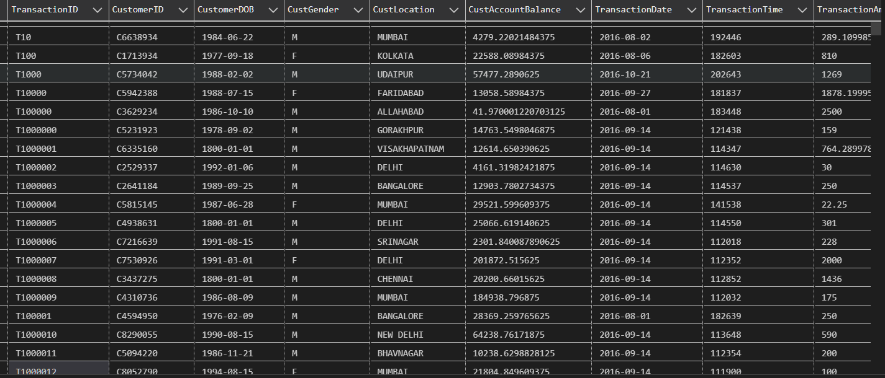
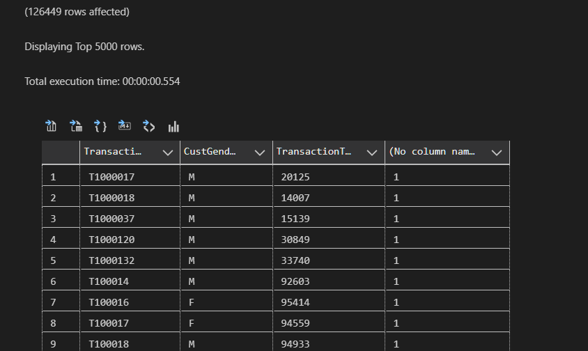
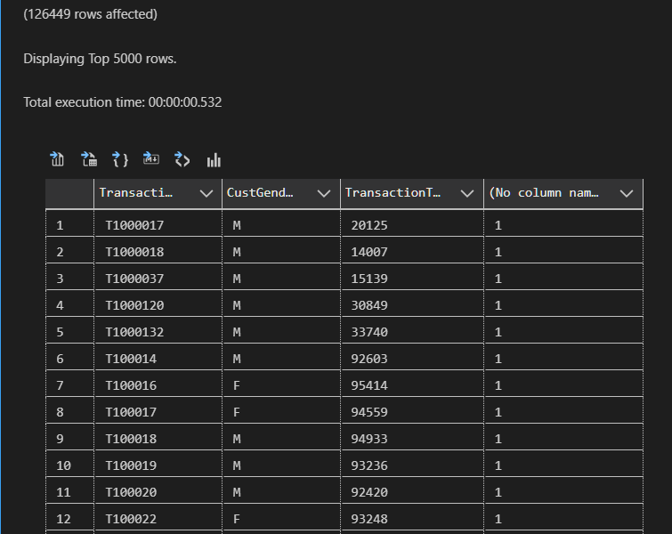
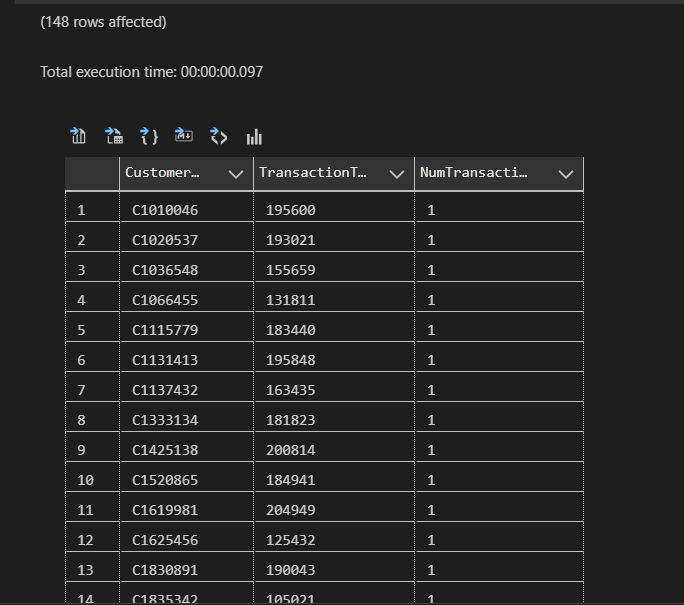
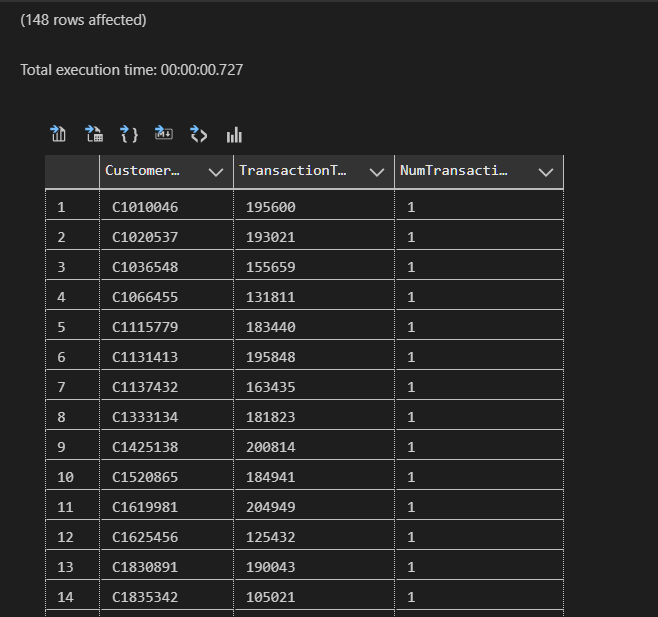

# Ex1: Tìm structured dataset có 1,000,000 dòng; insert vào 1 hoặc nhiều tables. Thực hiện các câu query có cùng output với việc sử dụng where, group by, having khác nhau. Đo và so sánh thời gian chạy!

## Dataset : Banking_Transactions
### Number of columns : 9
### Number of rows : 1.048.567


## `! Note :` `The results of having and where are the same`
### Simple query 
- #### Using Where
```sql
-- Using where
select TransactionID,CustGender,TransactionTime,count(*)
from dbo.sample_bank_transaction
where TransactionTime < 100000
group by TransactionID,CustGender,TransactionTime;
```
- #### Where result 


- #### Using Having
```sql
-- Using having
select TransactionID,CustGender,TransactionTime,count(*)
from dbo.sample_bank_transaction
group by TransactionID,CustGender,TransactionTime
having TransactionTime < 100000;
```

- #### Having result 


### More complex query
- #### Using Where
```sql
SELECT CustomerID, TransactionTime, COUNT(*) AS NumTransactions
FROM dbo.sample_bank_transaction
WHERE TransactionAmount_INR > 150000
GROUP BY CustomerID, TransactionTime
ORDER BY  CustomerID, TransactionTime;
```
- #### Where result 



- #### Using Having
```sql
SELECT CustomerID, TransactionTime, COUNT(*) AS NumTransactions
FROM dbo.sample_bank_transaction
GROUP BY CustomerID, TransactionTime
HAVING SUM(CASE WHEN TransactionAmount_INR > 150000 THEN 1 ELSE 0 END) > 0
ORDER BY  CustomerID, TransactionTime;
```
- #### Having result 


### => So the performance of `where` and `having` is up to the `complex of the query`. If it's `complex`, sure that the `where` is better,faster than the `having`. But in the very `simple` query. It's `not really difference`. 
### => Using `where` or `having` and how to optimize the performance is up to your `problem`.
